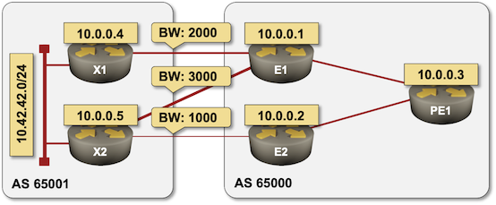

# BGP DMZ Bandwidth Test Lab

This lab setup was used to produce printouts in the _[Unequal-Cost Multipath with BGP DMZ Link Bandwidth](https://blog.ipspace.net/2021/06/ucmp-bgp-link-bandwidth.html)_ blog post.



The final router configurations are in the [config](config) directory. To recreate the lab:

* [Install *netlab*](https://netsim-tools.readthedocs.io/en/latest/install.html) and [create your lab environment](https://netsim-tools.readthedocs.io/en/latest/install.html#building-the-lab-environment)
* Copy [lab.yml](lab.yml) and Jinja2 templates into an empty directory (or clone this repository)
* Start the lab with **netlab up lab.yml**
* Configure BGP DMZ Bandwidth on the edge devices with

```
netlab config edge-bgp.j2 -l e1,e2
```

* Configure BGP DMZ Bandwidth on PE1 with

```
netlab config core-bgp.j2 -l pe1
```
