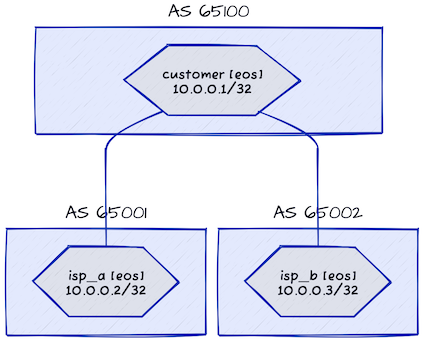

# Enforcing Default EBGP Policy (RFC 8212)

This directory contains *netlab* topology file that illustrates how FRR with defaults set to *traditional* enforces routing policies on EBGP sessions. See [Default EBGP Policy (RFC 8212)](https://blog.ipspace.net/2023/06/default-ebgp-policy-rfc-8212.html) blog post for more details.



## Changing Device Types

To test other devices supported by netlab, set the device type of the *customer* node with CLI parameters. You might also change the virtualization provider to *libvirt* or *virtualbox* (the topology file uses *containerlab*).

For example, use the following to start the lab with Cisco IOSv as the customer router:

```
netlab up -p libvirt -s nodes.customer.device=iosv
```
