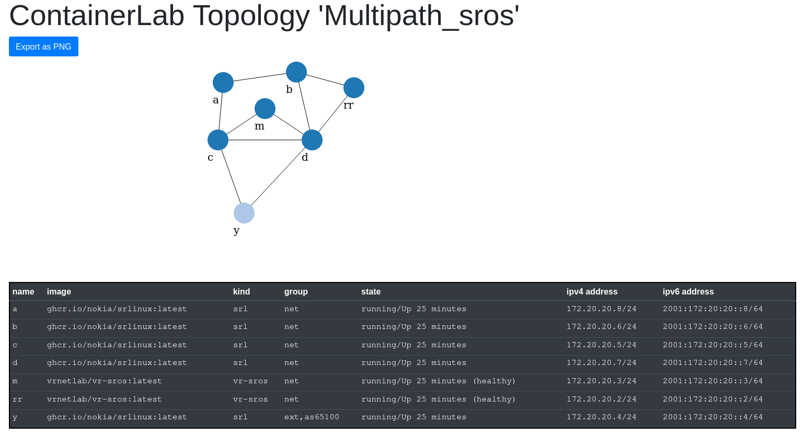

# BGP Add Path use case using Nokia SR OS and SR Linux nodes


This example is a variation on this [BGP Add Path example](../Multipath), using
a pair of SR OS nodes (RR and M) and a set of SR Linux devices instead.

# Prerequisites
* License file for the SR OS vSR VMs

# Instructions
```
netlab up
```

# Deep dive
This example uses the Initial, [OSPF](https://netsim-tools.readthedocs.io/en/latest/module/ospf.html) and [BGP](https://netsim-tools.readthedocs.io/en/latest/module/bgp.html) modules to provision a topology consisting of 7 nodes, 6 of which represent a network peering with an external network (Y).

The 6 internal nodes use a BGP Route Reflector (RR) for iBGP peering, and the use case revolves around providing optimal paths for each node in this asymmetric case. Specifically, node M could use multiple ECMP paths to reach external node Y - using BGP Add Path.

In terms of capabilities, Nokia SR OS supports BGP Add Path ([RFC7911](https://datatracker.ietf.org/doc/html/rfc7911)) but SR Linux does not. That is why nodes RR and M are implemented using SR OS, while the rest can use SRLinux.

## Base state without BGP Add Path

After commenting out the 'bgp-addpath.j2' custom config template, the initial state is as follows:

Every node is fully connected to OSPF neighbors:
```
A:admin@rr# show router ospf neighbor

===============================================================================
Rtr Base OSPFv2 Instance 0 Neighbors
===============================================================================
Interface-Name                   Rtr Id          State      Pri  RetxQ   TTL
   Area-Id
-------------------------------------------------------------------------------
i1/1/c1                          10.0.0.3        Full       1    0       30
   0.0.0.0
i1/1/c2                          10.0.0.5        Full       1    0       30
   0.0.0.0
-------------------------------------------------------------------------------
No. of Neighbors: 2
===============================================================================
```

The Route Reflector (RR) receives the external prefix 10.42.42.0/24 from both C and D, picking D because of the lower IGP cost from its perspective, 1 (via D) versus 17 via D(10.0.0.5) and then C(10.0.0.4):
```
A:admin@rr# show router bgp neighbor "10.0.0.4" received-routes | match 10.42.42.0 post-lines 2
*?    10.42.42.0/24                                      100         None
      10.0.0.4                                           None        17
      65100                                                          -

[/]
A:admin@rr# show router bgp neighbor "10.0.0.5" received-routes | match 10.42.42.0 post-lines 2
u*>?  10.42.42.0/24                                      100         None
      10.0.0.5                                           None        1
      65100                                                          -
```

It sends this single best route (via D) to M, note the "None" for Path ID:
```
A:admin@rr# show router bgp neighbor "10.0.0.6" advertised-routes | match 10.42.42.0 post-lines 2
?     10.42.42.0/24                                      100         None
      10.0.0.5                                           *None*      1
      65100                                                          -
```

### Adding BGP Add Path
```
netlab config bgp-addpath.j2
```

This configures both RR and M to support BGP Add path extensions, and in addition
configures the RR to ignore the IGP cost difference (as the cost can be different from client perspective)

This causes the RR to use both routes:
```
A:admin@rr# show router bgp routes | match 10.42.42.0 post-lines 2
===============================================================================
BGP IPv4 Routes
===============================================================================
Flag  Network                                            LocalPref   MED
      Nexthop (Router)                                   Path-Id     IGP Cost
      As-Path                                                        Label
-------------------------------------------------------------------------------
...
u*>?  10.42.42.0/24                                      100         None
      10.0.0.4                                           None        17
      65100                                                          -
u*>?  10.42.42.0/24                                      100         None
      10.0.0.5                                           None        1
      65100                                                          -
```

and to announce both to M, assigning different path IDs (1 via C, 2 via D):
```
A:admin@rr# show router bgp neighbor "10.0.0.6" advertised-routes | match 10.42.42 post-lines 2
?     10.42.42.0/24                                      100         None
      10.0.0.5                                           2           1
      65100                                                          -
?     10.42.42.0/24                                      100         None
      10.0.0.4                                           1           17
      65100                                                          -
```

At client M, both routes become active:
```
A:admin@m# show router bgp routes | match 10.42.42.0 post-lines 2
u*>?  10.42.42.0/24                                      100         None
      10.0.0.4                                           1           1
      65100                                                          -
u*>?  10.42.42.0/24                                      100         None
      10.0.0.5                                           2           1
      65100                                                          -
```

allowing M to reach Y via ECMP routes, via C and D:
```
A:admin@m# show router route-table | match 10.42.42.0 post-lines 1
10.42.42.0/24                                 Remote  BGP       00h01m03s  170
       10.1.0.33                                                    1
10.42.42.0/24                                 Remote  BGP       00h01m03s  170
       10.1.0.37                                                    1
```

each having the same IGP cost (1)
```
A:admin@m# show router bgp routes | match 10.42.42.0 post-lines 2
u*>?  10.42.42.0/24                                      100         None
      10.0.0.4                                           1           1
      65100                                                          -
u*>?  10.42.42.0/24                                      100         None
      10.0.0.5                                           2           1
      65100                                                          -
```

# Discussion: A BGP Anycast alternative
In [this blog](https://srlinux-at-your-service.medium.com/do-it-yourself-automation-for-bgp-anycast-introducing-one-next-hop-to-rule-them-all-173e21237a1f) an alternative solution is suggested, using BGP Anycast nexthops (using eBGP instead of OSPF as IGP)

To implement this option in NetSim-Tools, we need to do [the following](bgp-anycast.j2) for nodes C and D:
* Create an anycast loopback interface, assigning the same IP(10.0.0.45/32, could be any)
* Add this interface to OSPF
* Change the iBGP export policy to use the anycast IP as nexthop

The latter requires the use of SROS, as SR Linux does not (yet) support setting arbitrary next hop IPs in policies.

## Validation
With these changes, the (SR Linux) Route Reflector now receives:
```
A:rr# /show network-instance default protocols bgp neighbor 10.0.0.4 received-routes ipv4
----------------------------------------------------------------------------------------------
Peer        : 10.0.0.4, remote AS: 65000, local AS: 65000
Type        : static
Description : c
Group       : ibgp
----------------------------------------------------------------------------------------------
Status codes: u=used, *=valid, >=best, x=stale
Origin codes: i=IGP, e=EGP, ?=incomplete
+---------------------------------------------------------------------------------------------
|  Status       Network          Next Hop     MED     LocPref      AsPath       Origin       |
+============================================================================================+
|     *       10.0.0.1/32       10.0.0.45      2        100                       i          |
|     *       10.0.0.2/32       10.0.0.45      1        100                       i          |
|     *       10.0.0.3/32       10.0.0.45      2        100                       i          |
|     *       10.0.0.4/32       10.0.0.45      -        100                       i          |
|     *       10.0.0.5/32       10.0.0.45      1        100                       i          |
|     *       10.0.0.6/32       10.0.0.45      1        100                       i          |
|    u*>      10.0.0.7/32       10.0.0.45      -        100       [65100]         i          |
|     *       10.1.0.0/30       10.0.0.45      17       100                       i          |
|     *       10.1.0.4/30       10.0.0.45      -        100                       i          |
|     *       10.1.0.8/30       10.0.0.45      2        100                       i          |
|     *       10.1.0.12/30      10.0.0.45      -        100                       i          |
|     *       10.1.0.16/30      10.0.0.45      18       100                       i          |
|     *       10.1.0.20/30      10.0.0.45      2        100                       i          |
|    u*>      10.1.0.24/30      10.0.0.45      -        100                       i          |
|     *       10.1.0.28/30      10.0.0.45      -        100       [65100]         i          |
|     *       10.1.0.32/30      10.0.0.45      -        100                       i          |
|     *       10.1.0.36/30      10.0.0.45      2        100                       i          |
|    u*>      10.42.42.0/24     10.0.0.45      -        100       [65100]         ?          |
+--------------------------------------------------------------------------------------------+
18 received BGP routes : 3 used 18 valid
```
(this could be optimized, as only a few of these routes are actually used)

The RR is able to resolve the anycast nexthop through OSPF (if not, the route would become inactive).
It advertises the anycast route to node M:
```
A:rr# /show network-instance default protocols bgp neighbor 10.0.0.6 advertised-routes ipv4
-------------------------------------------------------------------------------------------
Peer        : 10.0.0.6, remote AS: 65000, local AS: 65000
Type        : static
Description : m
Group       : ibgp
---------------------------------------------------------------------------------
Origin codes: i=IGP, e=EGP, ?=incomplete
+--------------------------------------------------------------------------------
|   Network        Next Hop      MED       LocPref     AsPath      Origin       |
+===============================================================================+
| 10.0.0.1/32      10.0.0.1       -         100                      i          |
| 10.0.0.2/32      10.1.0.21      18        100                      i          |
| 10.0.0.3/32      10.1.0.17      16        100                      i          |
| 10.0.0.4/32      10.1.0.21      17        100                      i          |
| 10.0.0.5/32      10.1.0.21      16        100                      i          |
| 10.0.0.6/32      10.1.0.21      17        100                      i          |
| 10.0.0.7/32      10.0.0.45      -         100        [65100]       i          |
| 10.0.0.45/32     10.1.0.21      16        100                      i          |
| 10.1.0.0/30      10.1.0.17      32        100                      i          |
| 10.1.0.4/30      10.1.0.21      18        100                      i          |
| 10.1.0.8/30      10.1.0.21      17        100                      i          |
| 10.1.0.12/30     10.1.0.21      17        100                      i          |
| 10.1.0.16/30     10.0.0.1       -         100                      i          |
| 10.1.0.20/30     10.0.0.1       -         100                      i          |
| 10.1.0.24/30     10.0.0.45      -         100                      i          |
| 10.1.0.28/30     10.0.0.45      -         100                      i          |
| 10.1.0.32/30     10.1.0.21      18        100                      i          |
| 10.1.0.36/30     10.1.0.21      17        100                      i          |
| 10.42.42.0/24    10.0.0.45      -         100        [65100]       ?          |
+-------------------------------------------------------------------------------+
19 advertised BGP routes
```

At M, the route resolves to both C & D via OSPFv2 routes:
```
A:m# /show network-instance default route-table ipv4-unicast summary
-------------------------------------------------------------------------------------------------------------------------------
IPv4 unicast route table of network instance default
-------------------------------------------------------------------------------------------------------------------------------
+--------------------+-------+------------+---------------+----------+---------+-----------------------+----------------------+
|   Prefix           |  ID   | Route Type | Route Owner   |  Metric  |  Pref   |    Next-hop (Type)    |  Next-hop Interface  |
|                    |       |            |               |          |         |                       |                      |
+====================+=======+============+===============+==========+=========+=======================+======================+
| 10.0.0.1/32        | 0     | ospfv2     | ospf_mgr      | 17       | 10      | 10.1.0.37 (direct)    | ethernet-1/2.0       |
| 10.0.0.2/32        | 0     | ospfv2     | ospf_mgr      | 17       | 10      | 10.1.0.33 (direct)    | ethernet-1/1.0       |
| 10.0.0.3/32        | 0     | ospfv2     | ospf_mgr      | 17       | 10      | 10.1.0.37 (direct)    | ethernet-1/2.0       |
| 10.0.0.4/32        | 0     | ospfv2     | ospf_mgr      | 16       | 10      | 10.1.0.33 (direct)    | ethernet-1/1.0       |
| 10.0.0.5/32        | 0     | ospfv2     | ospf_mgr      | 16       | 10      | 10.1.0.37 (direct)    | ethernet-1/2.0       |
| 10.0.0.6/32        | 4     | host       | net_inst_mgr  | 0        | 0       | None (extract)        | None                 |
| 10.0.0.7/32        | 0     | bgp        | bgp_mgr       | 0        | 170     | 10.0.0.45 (indirect)  | None                 |
| 10.0.0.45/32  *    | 0     | ospfv2     | ospf_mgr      | 16       | 10      | 10.1.0.33 (direct)    | ethernet-1/1.0       |
|               *    |       |            |               |          |         | 10.1.0.37 (direct)    | ethernet-1/2.0       |
| 10.1.0.0/30        | 0     | ospfv2     | ospf_mgr      | 33       | 10      | 10.1.0.33 (direct)    | ethernet-1/1.0       |
|                    |       |            |               |          |         | 10.1.0.37 (direct)    | ethernet-1/2.0       |
| 10.1.0.4/30        | 0     | ospfv2     | ospf_mgr      | 17       | 10      | 10.1.0.33 (direct)    | ethernet-1/1.0       |
| 10.1.0.8/30        | 0     | ospfv2     | ospf_mgr      | 17       | 10      | 10.1.0.37 (direct)    | ethernet-1/2.0       |
| 10.1.0.12/30       | 0     | ospfv2     | ospf_mgr      | 17       | 10      | 10.1.0.33 (direct)    | ethernet-1/1.0       |
|                    |       |            |               |          |         | 10.1.0.37 (direct)    | ethernet-1/2.0       |
| 10.1.0.16/30       | 0     | ospfv2     | ospf_mgr      | 33       | 10      | 10.1.0.37 (direct)    | ethernet-1/2.0       |
| 10.1.0.20/30       | 0     | ospfv2     | ospf_mgr      | 17       | 10      | 10.1.0.37 (direct)    | ethernet-1/2.0       |
| 10.1.0.24/30       | 0     | bgp        | bgp_mgr       | 0        | 170     | 10.0.0.45 (indirect)  | None                 |
| 10.1.0.28/30       | 0     | bgp        | bgp_mgr       | 0        | 170     | 10.0.0.45 (indirect)  | None                 |
| 10.1.0.32/30       | 2     | local      | net_inst_mgr  | 0        | 0       | 10.1.0.34 (direct)    | ethernet-1/1.0       |
| 10.1.0.34/32       | 2     | host       | net_inst_mgr  | 0        | 0       | None (extract)        | None                 |
| 10.1.0.35/32       | 2     | host       | net_inst_mgr  | 0        | 0       | None (broadcast)      | None                 |
| 10.1.0.36/30       | 3     | local      | net_inst_mgr  | 0        | 0       | 10.1.0.38 (direct)    | ethernet-1/2.0       |
| 10.1.0.38/32       | 3     | host       | net_inst_mgr  | 0        | 0       | None (extract)        | None                 |
| 10.1.0.39/32       | 3     | host       | net_inst_mgr  | 0        | 0       | None (broadcast)      | None                 |
| 10.42.42.0/24  **  | 0     | bgp        | bgp_mgr       | 0        | 170     | 10.0.0.45 (indirect)  | None                 |
+--------------------+-------+------------+---------------+----------+---------+-----------------------+----------------------+
IPv4 routes total                    : 23
IPv4 prefixes with active routes     : 23
IPv4 prefixes with active ECMP routes: 3
```

This allows M to reach Y via both C and D paths, as desired:
```
A:m# traceroute 10.42.42.0

Using network instance default
traceroute to 10.42.42.0 (10.42.42.0), 30 hops max, 60 byte packets
 1  10.1.0.37 (10.1.0.37)  14.987 ms 10.1.0.33 (10.1.0.33)  6.913 ms  14.990 ms
 2  10.1.0.26 (10.1.0.26)  14.959 ms !X * *
--{ running }--[ network-instance default ]--

A:m# traceroute 10.42.42.0

Using network instance default
traceroute to 10.42.42.0 (10.42.42.0), 30 hops max, 60 byte packets
 1  10.1.0.33 (10.1.0.33)  8.477 ms 10.1.0.37 (10.1.0.37)  8.545 ms 10.1.0.33 (10.1.0.33)  8.557 ms
 2  10.1.0.26 (10.1.0.26)  13.088 ms !X * *
--{ running }--[ network-instance default ]--
```

## Comparison
Both approaches require the use of more advanced routing features that are not found on every device/NOS:
* BGP Add Path
* BGP nexthop with arbitrary IP

The addition of BGP Add Path requires a re-negotiation of capabilities, resetting the session, whereas anycast loopback interfaces replace existing routes and can be sent using regular BGP UPDATEs.

With Anycast next hops the same amount of routes are sent, whereas Add Path introduces extra routes (marked with path identifiers). In the anycast case, the RR is not aware of the local resolution of anycast paths; it is a more "decentralized" approach. Select traffic routes can be optimized using anycast, incrementally over time. Add Path is an all-or-nothing per-peer change, requiring changes to central Route Reflectors - arguably more risky
