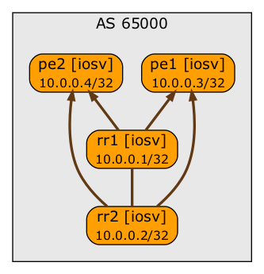

# Impact of BGP Route Reflector Cluster ID on BGP Updates

You can use this lab to investigate the impact of BGP RR Cluster ID on BGP updates. The BGP topology in the lab is as follow (arrows indicate IBGP sessions between route reflectors and their clients):

To set up this lab:

* [Install netlab](https://netsim-tools.readthedocs.io/en/latest/install.html) and a [virtualization environment of your choice](https://netsim-tools.readthedocs.io/en/latest/install.html#building-the-lab-environment)
* Copy topology.yml into an empty directory
* Execute **netlab up**

To configure the route reflectors in the lab to use BGP cluster ID, use `-s bgp.rr_cluster_id=10.0.0.1` parameter in **netlab up** or **netlab create** command.

To use different devices in the lab, use `-d` parameter in **netlab up** or **netlab create** command.
