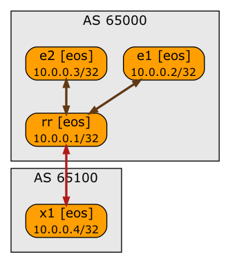

# BGP Route Reflector Next-Hop-Self Lab

This lab tests the behavior of BGP route reflectors configured with **next-hop-self** option on IBGP neighbor sessions. It uses the simplest possible lab topology:



If the BGP route reflector changes the next hop of a reflected route, the route originated by E2 will have RR as the next hop when observed on E1.

The lab topology uses Arista EOS devices with *libvirt* provider. Use *[netlab](https://netsim-tools.readthedocs.io/en/latest/)* release 1.1 or later to create the lab.

To start the lab with a different default device (for example, Cisco IOSv), use `-d` argument of **netlab up** command:

```
netlab up -d <type>
```

To start the lab with a different provider (for example, *containerlab*), use `-p` argument of **netlab up** command:

```
netlab up -p clab
```
