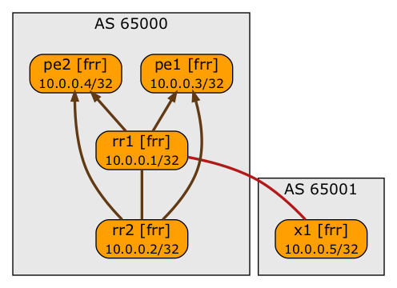

# BGP Route Reflector with EBGP Session

This lab illustrates the need for IBGP sessions between BGP route reflectors. The BGP topology in the lab is as follow (arrows indicate IBGP sessions between route reflectors and their clients):

To set up this lab:

* [Install netlab](https://netsim-tools.readthedocs.io/en/latest/install.html) on a Ubuntu machine with **pip3 install --upgrade networklab**
* Install Docker and Containerlab on the same machine with **netlab install containerlab**
* Copy topology.yml into an empty directory
* Execute **netlab up**
