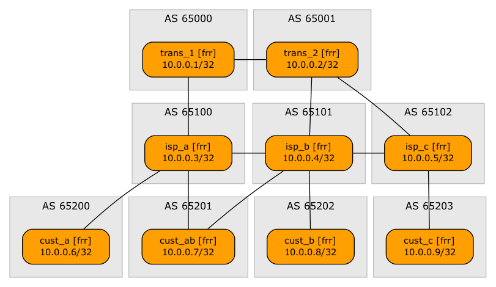

# Exercise: Fix BGP Route Leaks

This directory contains *netlab* topology file that you can use to practice BGP security tools. For more details, see blog.ipspace.net.



## Changing Device Types

The lab topology is using FRR containers, and the custom configuration templates that set BGP local preference is available for FRR, Cumulus Linux and Arista EOS.

You can use the lab with any other supported device, but unless you'll create a custom configuration template for your device you'll experience failures in the final step of the device configuration. Ignore them ;)

Use `-p` **netlab up** parameter to change the virtualization provider and `-d` parameter to change the device type. For example, use the following command to start the lab with Cisco IOSv as the customer router:

```
netlab up -p libvirt -d iosv
```
