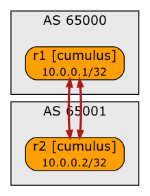

# Unnumbered BGP

This directory contains *netlab* topology file for a two-router unnumbered BGP test lab.



After starting the lab, explore the BGP sessions, BGP tables, and IP routing tables on R1 and R2.

## Changing Device Types

This topology can be used with all network devices supporting unnumbered EBGP sessions, and all virtualization providers supported by *netlab*:

* To change device type, use the `-d xxx` CLI argument
* To change the virtualization provider, use `-p` CLI argument.

For example, to start the lab with FRR containers, use:

```
netlab up -d frr -p clab
```
