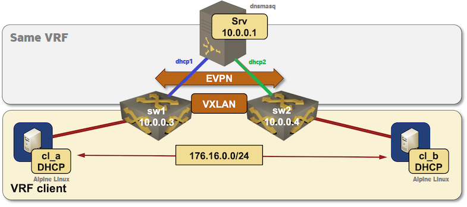

# DHCP relaying from an EVPN VRF - version 2

Inspired by ../evpn-relay with the following modifications:
1. Use dnsmasq (Linux container) as DHCP server
2. Use Alpine Linux clients
3. Use SR Linux for the relay switches
4. Symmetric IRB with separate VLANs within the same client VRF towards the DHCP server (using static routes)

After starting the lab, the clients (*cl_a* and *cl_b*) should get DHCP-assigned IP address on their lab-facing interfaces.

## Note on address pool selection
In this example dnsmasq selects an available pool based on the giaddress received from the relay agent.
Other arrangements are possible (e.g. using the Circuit ID information added by the relay agent)
