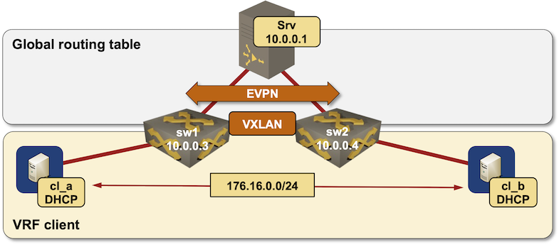

# DHCP relaying from an EVPN VRF

This directory contains *netlab* topology file used to test DHCP relaying from an EVPN VRF toward a DHCP server in the network core.

After starting the lab, the clients (*cl_a* and *cl_b*) should get DHCP-assigned IP address on their lab-facing interfaces.
