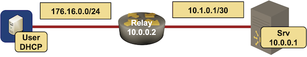

# DHCP relaying

This directory contains *netlab* topology file for a simple DHCP relaying scenario.

After starting the lab, the *user* device should get DHCP-assigned IP address on its lab-facing interface.

## Changing Device Types

This topology can be used with Cisco IOSv or Arista EOSv. To test it with other devices, add custom configuration template to `dhcp-relay` directory.

The easiest way to change the device types is to edit the topology file. You could also use the **netlab up** [CLI arguments](https://netsim-tools.readthedocs.io/en/latest/netlab/up.html#usage) -- to change the DHCP relay device type, use `-s nodes.relay.device=xxx` CLI argument.
