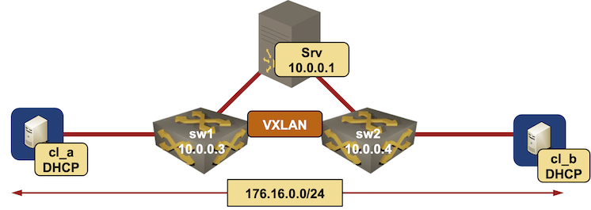

# DHCP relaying from a VXLAN segment

This directory contains *netlab* topology file used to test DHCP relaying in a VXLAN environment with redundant access switches using an anycast gateway.

After starting the lab, the clients (*cl_a* and *cl_b*) should get DHCP-assigned IP address on their lab-facing interfaces.
