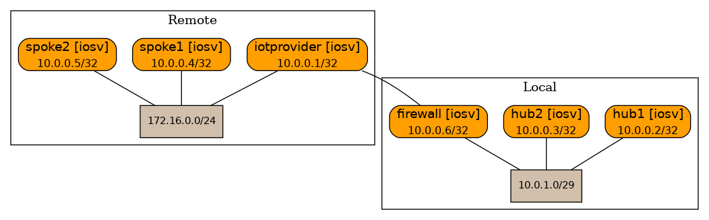
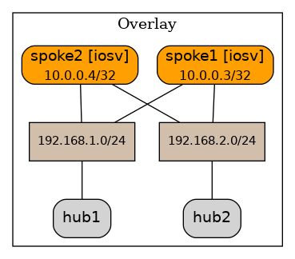

## DMVPN lab topology
In this lab topology a situation is simulated where an IPsec interconnect to a 4G IoT provider is used to connect 4G enabled spoke routers to local hub routers and configure a DMVPN overlay over which anything can be routed.



### Overlay network

The diagram below display the resulting overlay network. Each hub is connected to each spoke with its own NHRP instance and subnet.



Some notes:
- The IoT provider / underlay network is configured with static routes.
- The uplink to the IoT provider is an IPsec tunnel.
- An ACL prevents direct traffic between spokes over the 4G underlay, simulating the properties of a 4G network.
- In the lab a routed IPsec tunnel is used whereas a provider would typically use a policy based IPsec tunnel. 
- `10.0.1.0/29` is used for the hub interconnects and as such is part of both the underlay as well as the overlay network. 
- To counter recursive routing the spokes are configured with a specific static route for the /29 subnet.
- IPsec encryption of the GRE tunnels can be added by adding the IPsec policy and transform set etc. as well as the `tunnel protection IPsec profile <ipsec profile>` statement on the tunnel interfaces, with the additional keyword `shared` added to the spoke tunnel interfaces.
- An OSPF cost statement on the hub2 tunnel1 interface turns the hubs into an active/standby setup (`ip ospf cost 2000`).

### Verification
#### hub1
```
hub1#show dmvpn
Legend: Attrb --> S - Static, D - Dynamic, I - Incomplete
	N - NATed, L - Local, X - No Socket
	T1 - Route Installed, T2 - Nexthop-override
	C - CTS Capable
	# Ent --> Number of NHRP entries with same NBMA peer
	NHS Status: E --> Expecting Replies, R --> Responding, W --> Waiting
	UpDn Time --> Up or Down Time for a Tunnel
==========================================================================

Interface: Tunnel0, IPv4 NHRP Details 
Type:Hub, NHRP Peers:2, 

 # Ent  Peer NBMA Addr Peer Tunnel Add State  UpDn Tm Attrb
 ----- --------------- --------------- ----- -------- -----
     1 172.16.0.3          192.168.1.3    UP 00:22:05     D
     1 172.16.0.4          192.168.1.4    UP 00:03:44     D

```
Routes:
```
S*    0.0.0.0/0 [1/0] via 10.0.1.6
      10.0.0.0/8 is variably subnetted, 6 subnets, 2 masks
C        10.0.0.1/32 is directly connected, Loopback0
O        10.0.0.2/32 [110/2] via 10.0.1.2, 00:25:37, GigabitEthernet0/1
O        10.0.0.3/32 [110/1001] via 192.168.1.3, 00:22:07, Tunnel0
O        10.0.0.4/32 [110/1001] via 192.168.1.4, 00:03:54, Tunnel0
C        10.0.1.0/29 is directly connected, GigabitEthernet0/1
L        10.0.1.1/32 is directly connected, GigabitEthernet0/1
      192.168.1.0/24 is variably subnetted, 4 subnets, 2 masks
C        192.168.1.0/24 is directly connected, Tunnel0
L        192.168.1.1/32 is directly connected, Tunnel0
O        192.168.1.3/32 [110/1000] via 192.168.1.3, 00:22:07, Tunnel0
O        192.168.1.4/32 [110/1000] via 192.168.1.4, 00:03:54, Tunnel0
      192.168.2.0/32 is subnetted, 3 subnets
O        192.168.2.2 [110/1] via 10.0.1.2, 00:25:37, GigabitEthernet0/1
O        192.168.2.3 [110/1000] via 192.168.1.3, 00:22:07, Tunnel0
O        192.168.2.4 [110/1000] via 192.168.1.4, 00:03:54, Tunnel0
```
#### hub2
```
hub2#sh dmvpn
Legend: Attrb --> S - Static, D - Dynamic, I - Incomplete
	N - NATed, L - Local, X - No Socket
	T1 - Route Installed, T2 - Nexthop-override
	C - CTS Capable
	# Ent --> Number of NHRP entries with same NBMA peer
	NHS Status: E --> Expecting Replies, R --> Responding, W --> Waiting
	UpDn Time --> Up or Down Time for a Tunnel
==========================================================================

Interface: Tunnel0, IPv4 NHRP Details 
Type:Hub, NHRP Peers:2, 

 # Ent  Peer NBMA Addr Peer Tunnel Add State  UpDn Tm Attrb
 ----- --------------- --------------- ----- -------- -----
     1 172.16.0.3          192.168.2.3    UP 00:23:28     D
     1 172.16.0.4          192.168.2.4    UP 00:04:54     D
```
Routes:
```
S*    0.0.0.0/0 [1/0] via 10.0.1.6
      10.0.0.0/8 is variably subnetted, 6 subnets, 2 masks
O        10.0.0.1/32 [110/2] via 10.0.1.1, 00:27:05, GigabitEthernet0/1
C        10.0.0.2/32 is directly connected, Loopback0
O        10.0.0.3/32 [110/1001] via 192.168.2.3, 00:23:41, Tunnel0
O        10.0.0.4/32 [110/1001] via 192.168.2.4, 00:05:01, Tunnel0
C        10.0.1.0/29 is directly connected, GigabitEthernet0/1
L        10.0.1.2/32 is directly connected, GigabitEthernet0/1
      192.168.1.0/32 is subnetted, 3 subnets
O        192.168.1.1 [110/1] via 10.0.1.1, 00:27:05, GigabitEthernet0/1
O        192.168.1.3 [110/1000] via 192.168.2.3, 00:23:31, Tunnel0
O        192.168.1.4 [110/1000] via 192.168.2.4, 00:05:01, Tunnel0
      192.168.2.0/24 is variably subnetted, 4 subnets, 2 masks
C        192.168.2.0/24 is directly connected, Tunnel0
L        192.168.2.2/32 is directly connected, Tunnel0
O        192.168.2.3/32 [110/1000] via 192.168.2.3, 00:23:41, Tunnel0
O        192.168.2.4/32 [110/1000] via 192.168.2.4, 00:05:01, Tunnel0
```
#### spoke1
```
spoke1#show dmvpn
Legend: Attrb --> S - Static, D - Dynamic, I - Incomplete
	N - NATed, L - Local, X - No Socket
	T1 - Route Installed, T2 - Nexthop-override
	C - CTS Capable
	# Ent --> Number of NHRP entries with same NBMA peer
	NHS Status: E --> Expecting Replies, R --> Responding, W --> Waiting
	UpDn Time --> Up or Down Time for a Tunnel
==========================================================================

Interface: Tunnel0, IPv4 NHRP Details 
Type:Spoke, NHRP Peers:1, 

 # Ent  Peer NBMA Addr Peer Tunnel Add State  UpDn Tm Attrb
 ----- --------------- --------------- ----- -------- -----
     1 10.0.1.1            192.168.1.1    UP 00:22:00     S

Interface: Tunnel1, IPv4 NHRP Details 
Type:Spoke, NHRP Peers:1, 

 # Ent  Peer NBMA Addr Peer Tunnel Add State  UpDn Tm Attrb
 ----- --------------- --------------- ----- -------- -----
     1 10.0.1.2            192.168.2.2    UP 00:22:01     S
```
Routes:
```
      10.0.0.0/8 is variably subnetted, 5 subnets, 2 masks
O        10.0.0.1/32 [110/1001] via 192.168.1.1, 00:22:09, Tunnel0
O        10.0.0.2/32 [110/1001] via 192.168.2.2, 00:22:19, Tunnel1
C        10.0.0.3/32 is directly connected, Loopback0
O        10.0.0.4/32 [110/2001] via 192.168.2.2, 00:05:01, Tunnel1
                     [110/2001] via 192.168.1.1, 00:05:11, Tunnel0
S        10.0.1.0/29 [1/0] via 172.16.0.1
      172.16.0.0/16 is variably subnetted, 2 subnets, 2 masks
C        172.16.0.0/24 is directly connected, GigabitEthernet0/1
L        172.16.0.3/32 is directly connected, GigabitEthernet0/1
      192.168.1.0/24 is variably subnetted, 4 subnets, 2 masks
C        192.168.1.0/24 is directly connected, Tunnel0
O        192.168.1.1/32 [110/1000] via 192.168.1.1, 00:22:09, Tunnel0
L        192.168.1.3/32 is directly connected, Tunnel0
O        192.168.1.4/32 [110/2000] via 192.168.2.2, 00:05:01, Tunnel1
                        [110/2000] via 192.168.1.1, 00:05:11, Tunnel0
      192.168.2.0/24 is variably subnetted, 4 subnets, 2 masks
C        192.168.2.0/24 is directly connected, Tunnel1
O        192.168.2.2/32 [110/1000] via 192.168.2.2, 00:22:19, Tunnel1
L        192.168.2.3/32 is directly connected, Tunnel1
O        192.168.2.4/32 [110/2000] via 192.168.2.2, 00:05:01, Tunnel1
                        [110/2000] via 192.168.1.1, 00:05:01, Tunnel0
```

