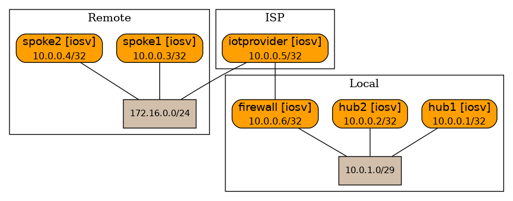

## DMVPN lab topology
In this lab topology a situation is simulated where an IPsec interconnect to a 4G IoT provider is used to connect 4G enabled spoke routers to local hub routers. After running `netlab up` run `netlab config iosv.j2` to deploy the DMVPN configuration.



Some notes:
- The IoT provider / underlay network is simulated with static routes.
- An ACL prevents direct traffic between spokes over the 4G underlay, simulating the properties of a 4G network.
- In the lab a routed IPsec tunnel is used whereas a provider would typically use a policy based IPsec tunnel. 
- In the `lab 10.0.1.0/24` is part of the (imaginary) P2 proposal, `10.0.1.0/29` is used for the hub interconnects and as such is part of both the underrlay as well as the overlay network. 
- To counter recursive routing the spokes are configured with a specific static route for the /29 subnet.
- IPsec encryption of the GRE tunnels can be added by adding the IPsec policy and transform set etc. as well as the `tunnel protection IPsec profile <ipsec profile>` statement on the tunnel interfaces, with the additional keyword `shared` added to the spoke tunnel interfaces.

### Verification
#### hub1
```
hub1#show dmvpn
Legend: Attrb --> S - Static, D - Dynamic, I - Incomplete
	N - NATed, L - Local, X - No Socket
	T1 - Route Installed, T2 - Nexthop-override
	C - CTS Capable
	# Ent --> Number of NHRP entries with same NBMA peer
	NHS Status: E --> Expecting Replies, R --> Responding, W --> Waiting
	UpDn Time --> Up or Down Time for a Tunnel
==========================================================================

Interface: Tunnel1, IPv4 NHRP Details 
Type:Hub, NHRP Peers:2, 

 # Ent  Peer NBMA Addr Peer Tunnel Add State  UpDn Tm Attrb
 ----- --------------- --------------- ----- -------- -----
     1 172.16.0.4          192.168.1.4    UP 02:20:27     D
     1 172.16.0.5          192.168.1.5    UP 02:20:27     D

```
Routes:
```
S*    0.0.0.0/0 [1/0] via 10.0.1.1
      10.0.0.0/8 is variably subnetted, 6 subnets, 2 masks
C        10.0.0.2/32 is directly connected, Loopback0
O        10.0.0.3/32 [110/2] via 10.0.1.3, 02:24:52, GigabitEthernet0/1
O        10.0.0.4/32 [110/1001] via 192.168.1.4, 02:23:43, Tunnel1
O        10.0.0.5/32 [110/1001] via 192.168.1.5, 02:23:33, Tunnel1
C        10.0.1.0/29 is directly connected, GigabitEthernet0/1
L        10.0.1.2/32 is directly connected, GigabitEthernet0/1
      192.168.1.0/24 is variably subnetted, 4 subnets, 2 masks
C        192.168.1.0/24 is directly connected, Tunnel1
L        192.168.1.1/32 is directly connected, Tunnel1
O        192.168.1.4/32 [110/1000] via 192.168.1.4, 02:23:43, Tunnel1
O        192.168.1.5/32 [110/1000] via 192.168.1.5, 02:23:33, Tunnel1
      192.168.2.0/32 is subnetted, 3 subnets
O        192.168.2.1 [110/1] via 10.0.1.3, 02:24:52, GigabitEthernet0/1
O        192.168.2.4 [110/1000] via 192.168.1.4, 02:23:33, Tunnel1
O        192.168.2.5 [110/1000] via 192.168.1.5, 02:23:33, Tunnel1
```
#### hub2
```
hub2#sh dmvpn 
Legend: Attrb --> S - Static, D - Dynamic, I - Incomplete
	N - NATed, L - Local, X - No Socket
	T1 - Route Installed, T2 - Nexthop-override
	C - CTS Capable
	# Ent --> Number of NHRP entries with same NBMA peer
	NHS Status: E --> Expecting Replies, R --> Responding, W --> Waiting
	UpDn Time --> Up or Down Time for a Tunnel
==========================================================================

Interface: Tunnel1, IPv4 NHRP Details 
Type:Hub, NHRP Peers:2, 

 # Ent  Peer NBMA Addr Peer Tunnel Add State  UpDn Tm Attrb
 ----- --------------- --------------- ----- -------- -----
     1 172.16.0.4          192.168.2.4    UP 02:27:21     D
     1 172.16.0.5          192.168.2.5    UP 02:27:21     D

```
Routes:
```
S*    0.0.0.0/0 [1/0] via 10.0.1.1
      10.0.0.0/8 is variably subnetted, 6 subnets, 2 masks
O        10.0.0.2/32 [110/2] via 10.0.1.2, 02:28:54, GigabitEthernet0/1
C        10.0.0.3/32 is directly connected, Loopback0
O        10.0.0.4/32 [110/1001] via 192.168.2.4, 02:27:35, Tunnel1
O        10.0.0.5/32 [110/1001] via 192.168.2.5, 02:27:35, Tunnel1
C        10.0.1.0/29 is directly connected, GigabitEthernet0/1
L        10.0.1.3/32 is directly connected, GigabitEthernet0/1
      192.168.1.0/32 is subnetted, 3 subnets
O        192.168.1.1 [110/1] via 10.0.1.2, 02:28:54, GigabitEthernet0/1
O        192.168.1.4 [110/1000] via 192.168.2.4, 02:27:35, Tunnel1
O        192.168.1.5 [110/1000] via 192.168.2.5, 02:27:35, Tunnel1
      192.168.2.0/24 is variably subnetted, 4 subnets, 2 masks
C        192.168.2.0/24 is directly connected, Tunnel1
L        192.168.2.1/32 is directly connected, Tunnel1
O        192.168.2.4/32 [110/1000] via 192.168.2.4, 02:27:35, Tunnel1
O        192.168.2.5/32 [110/1000] via 192.168.2.5, 02:27:35, Tunnel1

```
#### spoke1
```
spoke1#show dmvpn
Legend: Attrb --> S - Static, D - Dynamic, I - Incomplete
	N - NATed, L - Local, X - No Socket
	T1 - Route Installed, T2 - Nexthop-override
	C - CTS Capable
	# Ent --> Number of NHRP entries with same NBMA peer
	NHS Status: E --> Expecting Replies, R --> Responding, W --> Waiting
	UpDn Time --> Up or Down Time for a Tunnel
==========================================================================

Interface: Tunnel1, IPv4 NHRP Details 
Type:Spoke, NHRP Peers:1, 

 # Ent  Peer NBMA Addr Peer Tunnel Add State  UpDn Tm Attrb
 ----- --------------- --------------- ----- -------- -----
     1 10.0.1.2            192.168.1.1    UP 02:21:43     S

Interface: Tunnel2, IPv4 NHRP Details 
Type:Spoke, NHRP Peers:1, 

 # Ent  Peer NBMA Addr Peer Tunnel Add State  UpDn Tm Attrb
 ----- --------------- --------------- ----- -------- -----
     1 10.0.1.3            192.168.2.1    UP 02:21:40     S
```
Routes:
```
      10.0.0.0/8 is variably subnetted, 6 subnets, 3 masks
O        10.0.0.2/32 [110/1001] via 192.168.1.1, 02:22:37, Tunnel1
O        10.0.0.3/32 [110/1001] via 192.168.2.1, 02:22:27, Tunnel2
C        10.0.0.4/32 is directly connected, Loopback0
O        10.0.0.5/32 [110/2001] via 192.168.2.1, 02:22:27, Tunnel2
                     [110/2001] via 192.168.1.1, 02:22:27, Tunnel1
S        10.0.1.0/24 [1/0] via 172.16.0.1
S        10.0.1.0/29 [1/0] via 172.16.0.1
      172.16.0.0/16 is variably subnetted, 2 subnets, 2 masks
C        172.16.0.0/24 is directly connected, GigabitEthernet0/1
L        172.16.0.4/32 is directly connected, GigabitEthernet0/1
      192.168.1.0/24 is variably subnetted, 4 subnets, 2 masks
C        192.168.1.0/24 is directly connected, Tunnel1
O        192.168.1.1/32 [110/1000] via 192.168.1.1, 02:22:37, Tunnel1
L        192.168.1.4/32 is directly connected, Tunnel1
O        192.168.1.5/32 [110/2000] via 192.168.2.1, 02:22:27, Tunnel2
                        [110/2000] via 192.168.1.1, 02:22:27, Tunnel1
      192.168.2.0/24 is variably subnetted, 4 subnets, 2 masks
C        192.168.2.0/24 is directly connected, Tunnel2
O        192.168.2.1/32 [110/1000] via 192.168.2.1, 02:22:27, Tunnel2
L        192.168.2.4/32 is directly connected, Tunnel2
O        192.168.2.5/32 [110/2000] via 192.168.2.1, 02:22:27, Tunnel2
                        [110/2000] via 192.168.1.1, 02:22:27, Tunnel1

```

