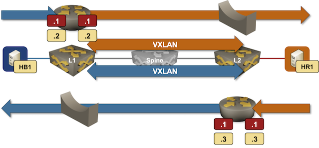

# EVPN Asymmetric IRB with Anycast Gateways

The lab topology sets up a simple EVPN fabric with asymmetric IRB and anycast gateways. Hosts use the first IP address in the subnet (the anycast gateway) as the default gateway.

The directory contains two custom configuration scripts that configure anycast gateways on Arista EOS:

* The `add_anycast` script configures an anycast IP address *in addition to* the unicast IP address. Each PE has two IP addresses (a unique one and a shared one).

* The `anycast_only` script replaces the unique IP addresses the PE devices use on VLAN interfaces with shared IP addresses.
