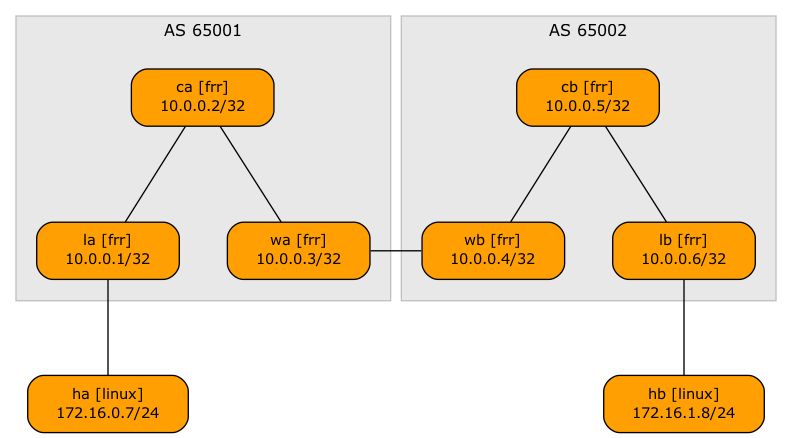

# Inter-AS EVPN (Option A)

This directory contains the minimum lab topology needed to demonstrate a two-site EVPN network with a VRF link between the sites.

* The switches within a single site run OSPF, IBGP full mesh, and EVPN.
* The link between the sites belongs to the tenant VRF (you could also use a VRF within a VLAN trunk)
* WAN edge routers have an EBGP session in the tenant VRF. The routes exchanged over that session are propagated over intra-site EVPN as type-5 routes.
