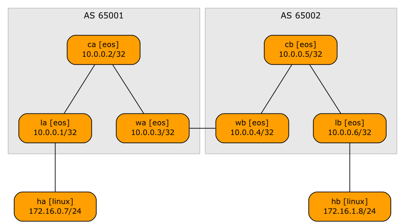
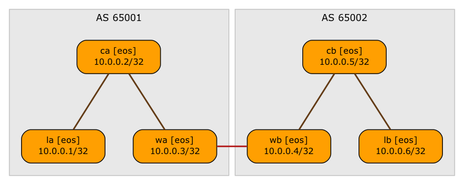
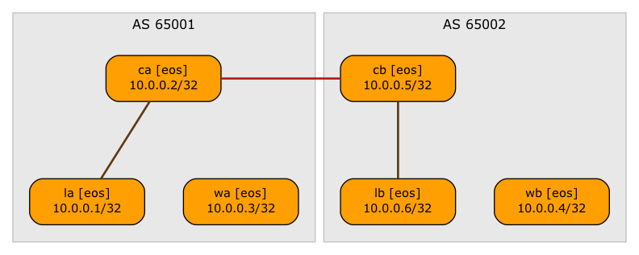

# EVPN Inter-AS Option C (Multi-Pod EVPN)

This directory contains the minimum lab topology needed to demonstrate a multi-pod (two-site) EVPN network
with a multihop EBGP session between BGP route reflectors.

* The switches within a single site run OSPF and IBGP.
* The core switches are route reflectors
* IPv4 and EVPN prefixes are exchanged over all IBGP sessions.
* There's an underlay WAN link between the two sites, with an IPv4-only EBGP session between WA and WB.

* There's another multihop EBGP session exchanging EVPN routes between CA and CB

