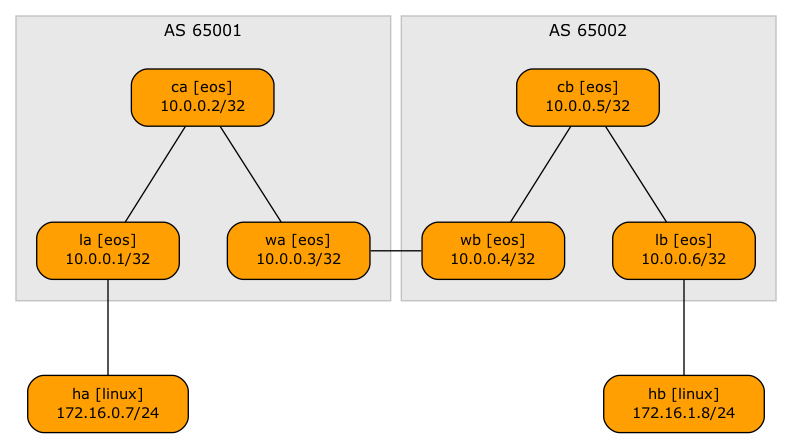
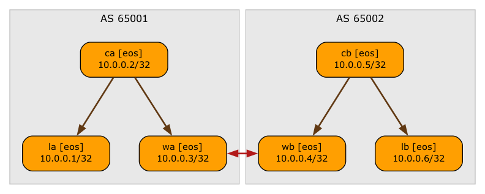

# Multi-Pod EVPN

This directory contains the minimum lab topology needed to demonstrate a multi-pod (two-site) EVPN network.

* The switches within a single site run OSPF and IBGP.
* The core switches are route reflectors
* There's an underlay WAN link between the two sites, with an EBGP session between WA and WB.
* IPv4 and EVPN prefixes are exchanged over all BGP sessions.

The following diagram displays the BGP sessions needed to support this design:

