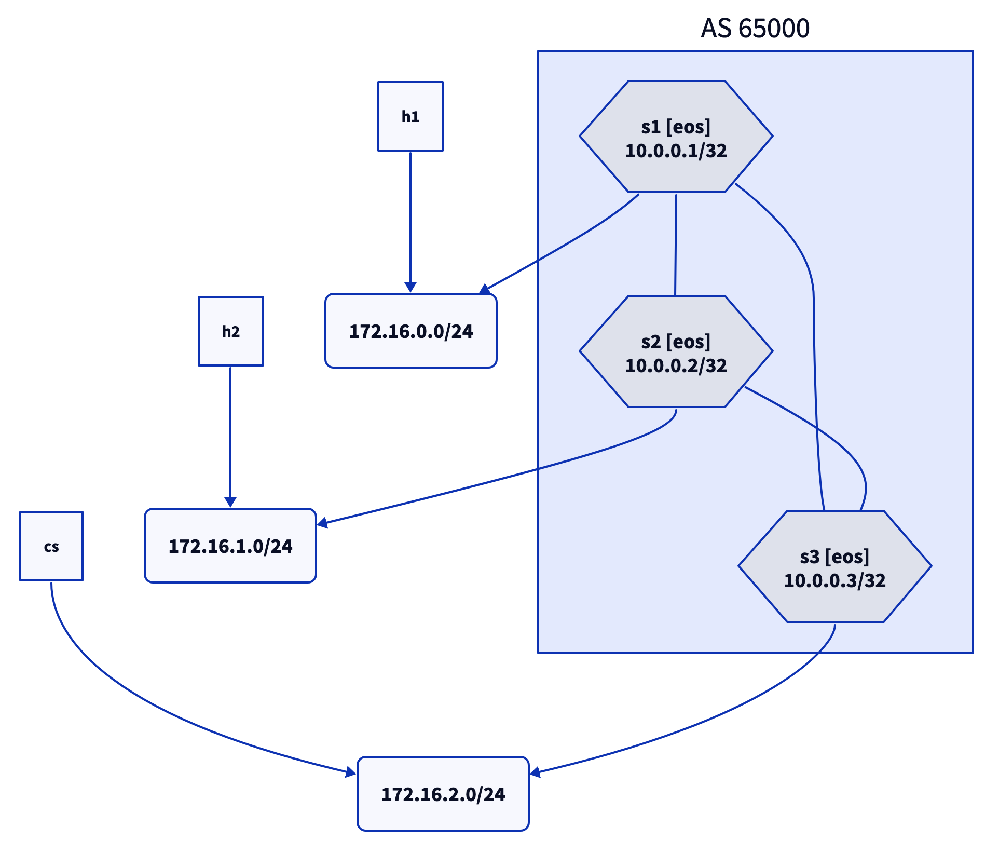

# Common Services VRF with EVPN Control Plane

This directory contains the lab topology used in the [Common Services VRF with EVPN Control Plane](https://blog.ipspace.net/2024/08/evpn-common-services-vrf/) blog post.

