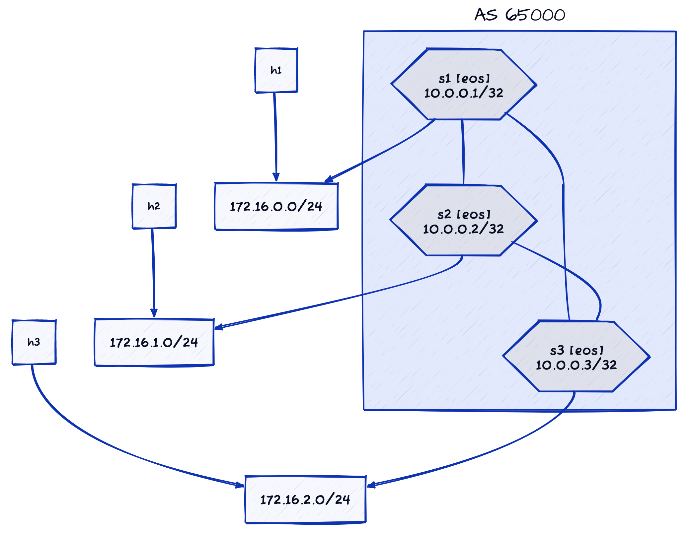

# Multiple Transit VNIs per EVPN VRF

This directory contains the lab topology used in the [Using Multiple Transit VNIs per EVPN VRF](https://blog.ipspace.net/2024/08/multiple-transit-vni-evpn-vrf/) blog post.

