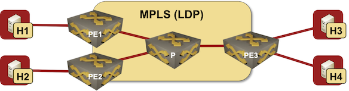

# EVPN/MPLS bridging

This directory contains *netlab* topology file for a simple MPLS bridging scenario with EVPN control plane -- a single VLAN bridged across an MPLS/LDP network.

The lab uses three PE-routers to illustrate a full mesh of MPLS circuits between them, and two hosts attached to one of the PE-routers to illustrate VLAN-wide sharing of unicast MPLS label.
 
After starting the lab, all hosts should be able to ping each other.

This topology was tested with Arista EOS PE-routers running vEOS 4.28.2F. EVPN control plane probably works with cEOS containers, [MPLS data plane might not](https://blog.ipspace.net/2022/03/dataplane-quirks-virtual-devices.html).