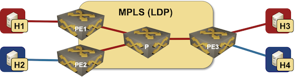

# EVPN/MPLS bridging

This directory contains *netlab* topology file for an EVPN VLAN-Aware Bundle Service running over MPLS transport.

The lab uses three PE-routers to illustrate a mesh of MPLS circuits between them, and hosts attached to two VLANs on one of the PE-routers to illustrate sharing of MPLS labels between different VLANs.
 
After starting the lab, hosts in the same lab should be able to ping each other.

This topology was tested with Arista EOS PE-routers running vEOS 4.28.2F. EVPN control plane probably works with cEOS containers, [MPLS data plane might not](https://blog.ipspace.net/2022/03/dataplane-quirks-virtual-devices.html).