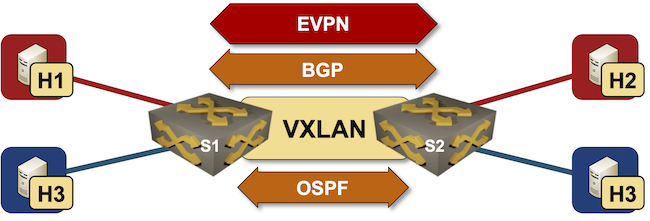

# EVPN/VXLAN bridging

This directory contains *netlab* topology file for a simple VXLAN bridging scenario with EVPN control plane -- two VLANs bridged across an IP underlay network.

After starting the lab, h1 should be able to ping h2, and h3 should be able to ping h4, but there should be no traffic routed between the VLANs. Also, the VLAN hosts should not be able to access the switches.

## Changing Device Types

This topology can be used with all network devices supporting VLAN, VXLAN, EVPN, BGP, and OSPF configuration modules, and all virtualization providers supported by *netlab*.

The easiest way to change the device types is to edit the topology file. You could also use the **netlab up** [CLI arguments](https://netsim-tools.readthedocs.io/en/latest/netlab/up.html#usage):

* To change the node device type, use `-s nodes._name_..device=xxx` CLI argument
* To change the virtualization provider, use `-p` CLI argument.
