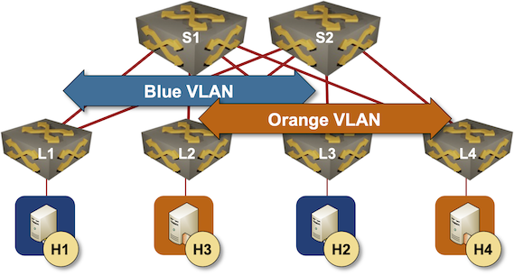
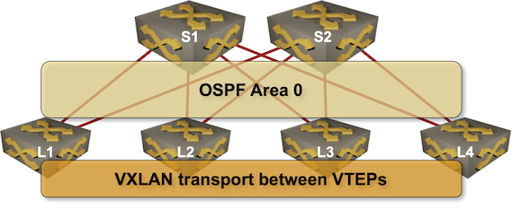

# EVPN Designs: VXLAN Leaf-and-Spine Fabric

This directory contains the lab topology described in the [EVPN Designs: VXLAN Leaf-and-Spine Fabric](https://blog.ipspace.net/2024/04/evpn-designs-vxlan-leaf-spine-fabric.html) blog post.

