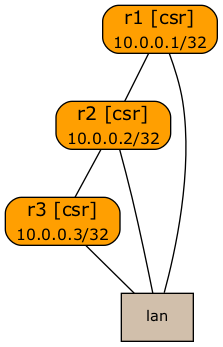

# Unnumbered IS-IS Test Lab

This 3-router topology tests IS-IS running over unnumbered IPv4 and IPv6 interfaces.

To repeat the experiment:

* [Install netlab](https://netsim-tools.readthedocs.io/en/latest/install.html), the [virtualization environment of your choice](https://netsim-tools.readthedocs.io/en/latest/install.html#building-the-lab-environment), and Vagrant boxes
* Copy **topology.yml** file from this repository into an empty directory
* Start the lab with **netlab up**
* Enjoy the ride
