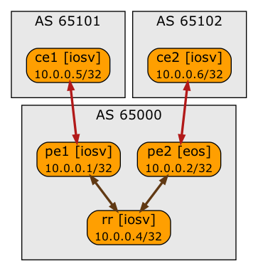
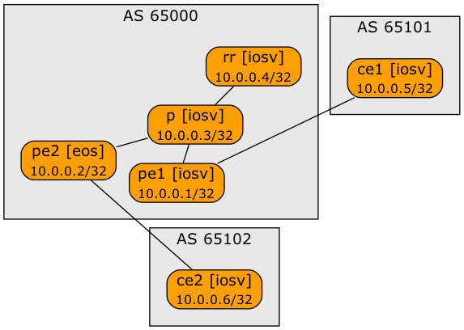

# MPLS LDP + BGP-LU Lab

This lab combines LDP within AS 65000 with BGP LU across three autonomous systems (AS 65000, AS 65101 and AS 65102):



The central autonomous system has a route reflector and a P-router that is not running BGP:



We're using LDP with OSPF to establish end-to-end MPLS paths across the central autonomous system.

The lab topology uses Arista EOS devices with *libvirt* provider. Use *[netlab](https://netsim-tools.readthedocs.io/en/latest/)* release 1.2 or later to create the lab.

To start the lab with a different default device (for example, Cisco IOSv), use `-d` argument of **netlab up** command:

```
netlab up -d <type>
```

To start the lab with a different provider (for example, *containerlab*), use `-p` argument of **netlab up** command:

```
netlab up -p clab
```

To test MPLS configuration module with other devices without changing the lab topology file, change the PE1 device type with `-s` argument of **netlab up** command:

```
netlab up -s nodes.pe1.device=<type>
```

You can combine both arguments. To start a lab with Cisco IOSv devices and Arista EOS running on PE1, use:

```
netlab up -d iosv -s nodes.pe1.device=eos
```
