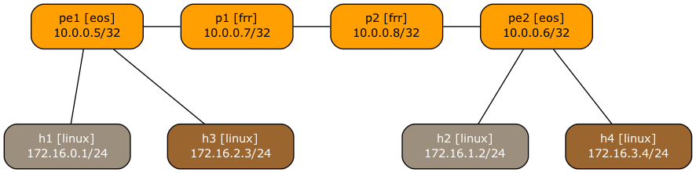

# Using MPLS/VPN with SR-MPLS Core

This directory contains a *netlab* topology file describing a simple MPLS/VPN network using an SR-MPLS core.

More details in the [Using L3VPN (MPLS/VPN) with SR-MPLS Core](https://blog.ipspace.net/2026/03/netlab-sr-mpls-l3vpn/) blog post.
