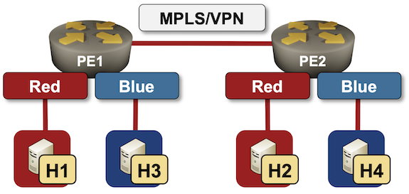

# MPLS/VPN Network with Simple VRFs

This directory contains *netlab* topology file describing a simple MPLS/VPN network with two PE-routers and two VRFs.



To test the topology, install *netlab* and Arista EOS boxes or containers, and execute **netlab up**

## Changing Device Types and Virtualization Providers

The test cases can be used with all network devices supporting VRF and MPLS configuration modules and all virtualization providers supported by *netlab*:

* To change the router device type, use `-d` CLI argument
* To change the virtualization provider, use `-p` CLI argument.

To start the lab with Cisco IOSv routers, use:

```
netlab up -d iosv
```

To start the lab with Cisco IOS XE router, use:

```
netlab up -d csr
```

To start the lab with Arista cEOS (using *containerlab*) use:

```
netlab up -p clab
```
