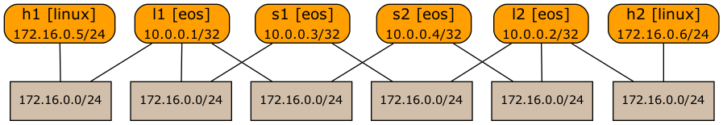

# Layer-2 Fabric

This directory contains *netlab* topology file for a leaf-and-spine layer-2 fabric.



After starting the lab, h1 and h2 should be able to ping each other.

## Changing Device Types

This topology can be used with all network devices supporting VLAN configuration module and all virtualization providers supported by *netlab*:

* To change the switch device type, use `-d <device>` CLI argument
* To change the virtualization provider, use `-p` CLI argument.

For example, to start the lab with Cisco IOSv devices, use:

```
netlab up -p libvirt -d iosv
```
