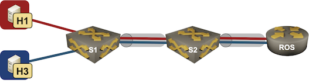

# Router-on-a-Stick Connected to a VLAN Trunk

This directory contains *netlab* topology file for a router-on-a-stick scenario with a two VLANs stretched across two switches and terminated on a router.



After starting the lab, *h1* should be able to ping *h3*.

## Changing Device Types

This topology can be used with all network devices supporting VLAN configuration module and all virtualization providers supported by *netlab*:

* To change all devices in the topology (apart from Linux hosts), use the `-d xxx` CLI argument
* To change the switch device type, use `-s groups.switches.device=xxx` CLI argument
* To change the router device type, use `-s groups.routers.device=xxx` CLI argument
* To change the virtualization provider, use `-p` CLI argument.

For example, to start the lab with Cisco IOSv devices, use:

```
netlab up -p libvirt -d iosv
```
