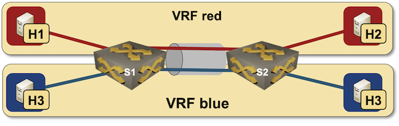

# Combining VLANs with VRFs

This directory contains *netlab* topology file for a VLAN trunk combined with VRFs: *red* VLAN is in *red* VRF, *blue* VLAN is in *blue* VRF



After starting the lab, h1 should be able to ping h2, but not h3 or h4 (they are in different VRF).

## Changing Device Types

This topology can be used with all network devices supporting VLAN configuration module and all virtualization providers supported by *netlab*:

* To change the switch device type, use `-s groups.switches.device=xxx` CLI argument
* To change the virtualization provider, use `-p` CLI argument.

For example, to start the lab with Cisco IOSv devices, use:

```
netlab up -p libvirt -s groups.switches.device=iosv
```
