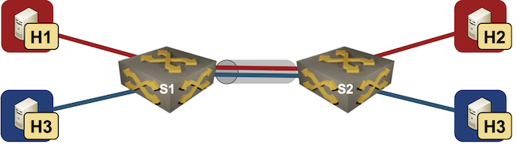

# VLAN Trunk

This directory contains *netlab* topology file for a simple VLAN trunk scenario with a two VLANs stretched across two switches.



After starting the lab, all hosts should be able to ping each other and the VLAN interfaces of s1 and s2, but they should not be able to ping s1 *and* s2 loopback interfaces as the lab is not using dynamic routing.

## Changing Device Types

This topology can be used with all network devices supporting VLAN configuration module and all virtualization providers supported by *netlab*:

* To change the switch device type, use `-s groups.switches.device=xxx` CLI argument
* To change the virtualization provider, use `-p` CLI argument.

For example, to start the lab with Cisco IOSv devices, use:

```
netlab up -p libvirt -s groups.switches.device=iosv
```
