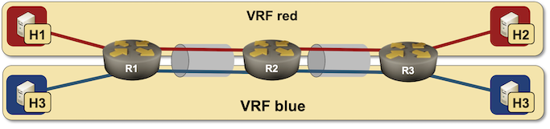

# Combining VLANs with VRFs

This directory contains *netlab* topology file for a routed VRF Lite solution.



The topology will create a separate subnet on every lab segment, and start OSPF routing processes in both VRFs to propagate IP subnets between R1, R2, and R3.

After starting the lab, h1 should be able to ping h2, but not h3 or h4 (they are in different VRF).

## Changing Device Types

This topology can be used with all network devices supporting VLAN, VRF and OSPF configuration modules, and all virtualization providers supported by *netlab*:

* To change the switch device type, use `-s groups.switches.device=xxx` CLI argument
* To change the virtualization provider, use `-p` CLI argument.

For example, to start the lab with Cisco IOSv devices, use:

```
netlab up -p libvirt -s groups.switches.device=iosv
```
