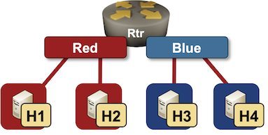
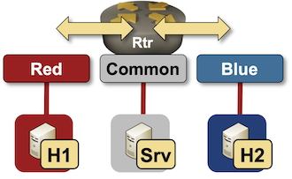

# VRF Lite with Hosts Test Cases

This directory contains *netlab* topology files describing several simple VRF Lite test cases containing a set of hosts attached to a single router.

The test cases can be used with all network devices supporting VRF configuration module and all virtualization providers supported by *netlab*:

* To change the router device type, use `-s nodes.rtr.device=xxx` CLI argument
* To change the virtualization provider, use `-p` CLI argument.

To start the lab with Cisco IOSv router, use:

```
netlab up -s nodes.rtr.device=iosv <topo-name>
```

To start the lab with Cisco IOS XE router, use:

```
netlab up -s nodes.rtr.device=csr <topo-name>
```

To start the lab with Arista cEOS (using *containerlab*) use:

```
netlab up -s nodes.rtr.device=eos -p clab <topo-name>
```

## Isolated VRFs

The `multi-vrf.yml` topology contains two isolated VRFs:

* VRF *red* containing Linux hosts h1 and h2
* VRF *blue* containing Linux hosts h3 and h4



After starting the lab, h1 should be able to ping h2 but not h3 or h4, and h3 should be able to ping h4 but not h1 or h2.

## Inter-VRF Route Leaking

The `vrf-route-leaking.yml` topology contains three VRFs:

* VRF *red* containing Linux host h1
* VRF *blue* containing Linux host h2
* VRF *common* contains Linux host srv

A simple common services VPN topology is set up to enable h1 and h2 to communicate with srv, but not with each other:



After starting the lab, h1 and h2 should be able to ping srv but not each other.
