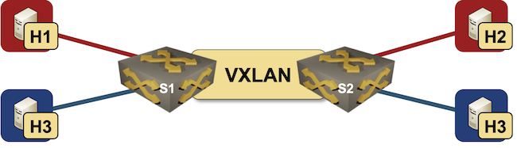

# VXLAN bridging

This directory contains *netlab* topology file for a simple VXLAN bridging scenario -- two VLANs bridged across an IP underlay network.



After starting the lab, h1 should be able to ping h2, and h3 should be able to ping h4, but there should be no traffic routed between the VLANs. Also, the VLAN hosts should not be able to access the switches.

**Note:** the lab topology uses the _[VLAN links](https://netsim-tools.readthedocs.io/en/latest/module/vlan.html#module-vlan-creating-access-links)_ functionality introduced in [netlab release 1.5.1](https://netsim-tools.readthedocs.io/en/latest/release/1.5.html#release-1-5-1).

## Changing Device Types

This topology can be used with all network devices supporting VLAN, VXLAN, and OSPF configuration modules, and all virtualization providers supported by *netlab*:

* To change the switch device type, use `-s groups.switches.device=xxx` CLI argument
* To change the virtualization provider, use `-p` CLI argument.

For example, to start the lab with Arista EOS devices running in _containerlab_, use:

```
netlab up -p clab -s groups.switches.device=eos
```
