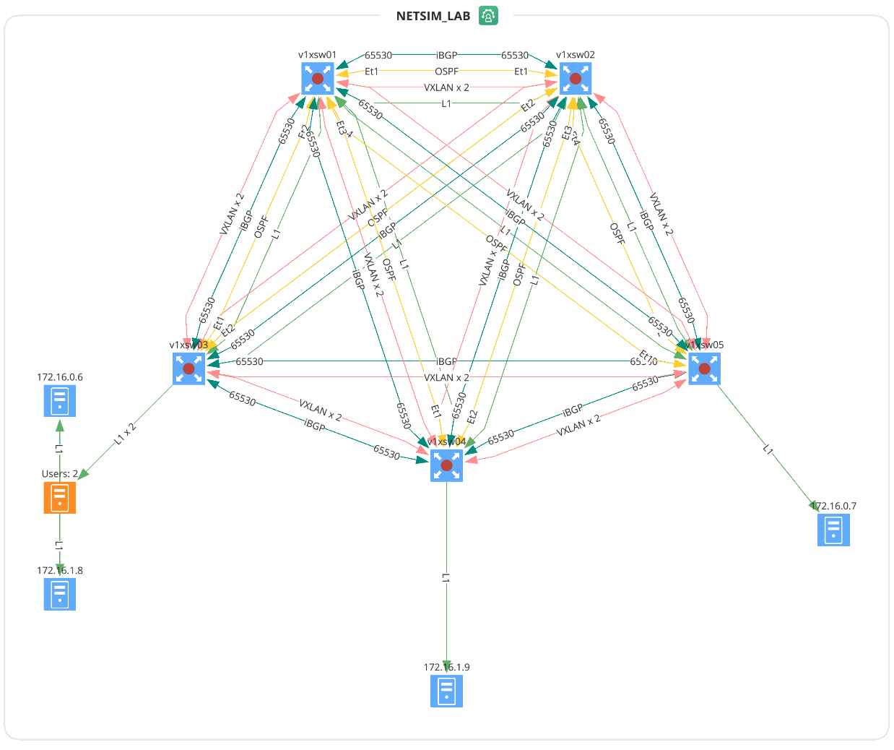
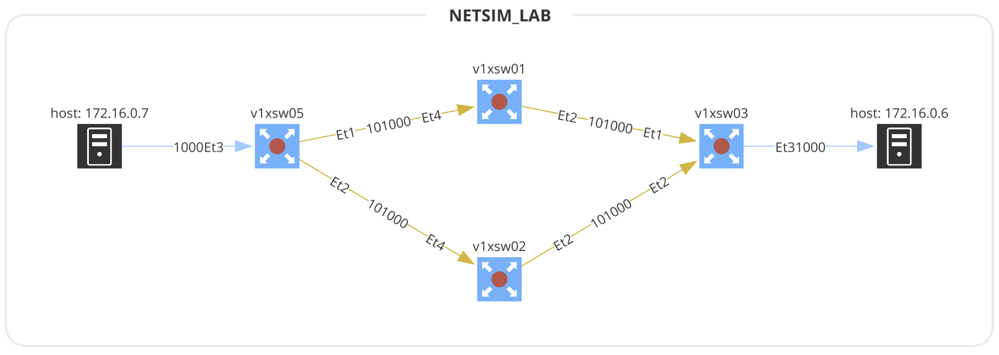

# VXLAN with OSPF, iBGP and EVPN running on Arista nodes

This lab creates a network topology with:

* Distibution nodes v1xsw01 and v1xsw02
* Access nodes v1xsw03-05
* 4 x linux hosts (red1-2, blue1-2)

## Arista VXLAN Lab summary

* distribution nodes v1xsw01 and v1xsw02 have both two connection to each of
* the access nodes v1xsw03-05
* Linux Servers are connected as access endpoints in their particular VLANs
  - red1 <> v1xsw03
  - red2 <> v1xsw05
  - blue1 <> v1xsw03
  - blue2 <> v1xsw04 are endpoints in each vrf
* VRF `tenant` is shared for both VLANs
## Device inventory

| **"Hostname"** | **"Site"**   | **"Serial Number"**                | **"Login IP"**    | **"Vendor"** | **"Family"** | **"Platform"** | **"Version"** | **"Type"** |
|----------------|--------------|------------------------------------|-------------------|--------------|--------------|----------------|---------------|------------|
| "v1xsw01"      | "NETSIM_LAB" | "480047408B1F3F39E0BCDD789F051E8C" | "192.168.121.101" | "arista"     | "eos"        | "lab"          | "4.27.0F"     | "l3switch" |
| "v1xsw02"      | "NETSIM_LAB" | "35B5FF3F67A3727E898C8C47154B747F" | "192.168.121.102" | "arista"     | "eos"        | "lab"          | "4.27.0F"     | "l3switch" |
| "v1xsw03"      | "NETSIM_LAB" | "C214E6FE44004228ADB3AD1A64A00068" | "192.168.121.103" | "arista"     | "eos"        | "lab"          | "4.27.0F"     | "l3switch" |
| "v1xsw04"      | "NETSIM_LAB" | "B3F272EA5BE256209152D9BDD9A5BB82" | "192.168.121.104" | "arista"     | "eos"        | "lab"          | "4.27.0F"     | "l3switch" |
| "v1xsw05"      | "NETSIM_LAB" | "DDCA5057D0E9B4FC9EDA31036EA95D08" | "192.168.121.105" | "arista"     | "eos"        | "lab"          | "4.27.0F"     | "l3switch" |


## VTEP Interfaces
| **"Hostname"** | **"Interface"** | **"Primary IP"** | **"Control Plane"** | **"Interface"** | **"Host Learn Mode"** | **"Source Int"** |
|----------------|-----------------|------------------|---------------------|-----------------|-----------------------|------------------|
| "v1xsw01"      | "Vx1"           | "10.0.0.1"       | "bgp-evpn"          | "vxlan"         | "control-plane"       | "Lo0"            |
| "v1xsw02"      | "Vx1"           | "10.0.0.2"       | "bgp-evpn"          | "vxlan"         | "control-plane"       | "Lo0"            |
| "v1xsw03"      | "Vx1"           | "10.0.0.3"       | "bgp-evpn"          | "vxlan"         | "control-plane"       | "Lo0"            |
| "v1xsw04"      | "Vx1"           | "10.0.0.4"       | "bgp-evpn"          | "vxlan"         | "control-plane"       | "Lo0"            |
| "v1xsw05"      | "Vx1"           | "10.0.0.5"       | "bgp-evpn"          | "vxlan"         | "control-plane"       | "Lo0"            |

## VNI to VLAN Mapping

| **"Hostname"** | **"Interface"** | **"BD"** | **"VNI"** | **"Mode"**      | **"Type"**  |
|----------------|-----------------|----------|-----------|-----------------|-------------|
| "v1xsw02"      | "Vx1"           | "1000"   | "101000"  | "control-plane" | "L2-static" |
| "v1xsw02"      | "Vx1"           | "1001"   | "101001"  | "control-plane" | "L2-static" |
| "v1xsw01"      | "Vx1"           | "1000"   | "101000"  | "control-plane" | "L2-static" |
| "v1xsw01"      | "Vx1"           | "1001"   | "101001"  | "control-plane" | "L2-static" |
| "v1xsw04"      | "Vx1"           | "1000"   | "101000"  | "control-plane" | "L2-static" |
| "v1xsw04"      | "Vx1"           | "1001"   | "101001"  | "control-plane" | "L2-static" |
| "v1xsw03"      | "Vx1"           | "1000"   | "101000"  | "control-plane" | "L2-static" |
| "v1xsw03"      | "Vx1"           | "1001"   | "101001"  | "control-plane" | "L2-static" |
| "v1xsw05"      | "Vx1"           | "1000"   | "101000"  | "control-plane" | "L2-static" |
| "v1xsw05"      | "Vx1"           | "1001"   | "101001"  | "control-plane" | "L2-static" |

## Network Topology



## Additional config files

BGP EVPN will not start without the multi-agent routing model. Recent cEOS versions
and Vagrant vEOS boxes built with the _netlab_ recipe already use multi-agent routing model,
but just in case you're using a Vagrant box without that setting, the `eos_vxlan.cfg`
configuration template enables is. When changing the routing model, you have to save the
VM config (with `wr mem`) and reload the device(s).

* eos_vxlan.cfg - to enable multi-agent routing model

## CLI outputs

Confirm established OSPF and BGP with EVPN

```shell
v1xsw05#sh ip ospf nei
Neighbor ID     Instance VRF      Pri State                  Dead Time   Address         Interface
10.0.0.1        1        default  0   FULL                   00:00:29    10.1.0.13       Ethernet1
10.0.0.2        1        default  0   FULL                   00:00:38    10.1.0.25       Ethernet2

v1xsw05#sh ip bgp summ
BGP summary information for VRF default
Router identifier 10.0.0.5, local AS number 65530
Neighbor Status Codes: m - Under maintenance
  Description              Neighbor         V AS           MsgRcvd   MsgSent  InQ OutQ  Up/Down State   PfxRcd PfxAcc
  v1xsw01                  10.0.0.1         4 65530            288       298    0    0 03:58:14 Estab   1      1
  v1xsw02                  10.0.0.2         4 65530            288       298    0    0 03:58:16 Estab   1      1
  v1xsw03                  10.0.0.3         4 65530            311       295    0    0 03:58:19 Estab   1      1
  v1xsw04                  10.0.0.4         4 65530            296       296    0    0 03:58:19 Estab   1      1

v1xsw05#sh bgp evpn summ
BGP summary information for VRF default
Router identifier 10.0.0.5, local AS number 65530
Neighbor Status Codes: m - Under maintenance
  Description              Neighbor         V AS           MsgRcvd   MsgSent  InQ OutQ  Up/Down State   PfxRcd PfxAcc
  v1xsw01                  10.0.0.1         4 65530            288       298    0    0 03:58:20 Estab   2      2
  v1xsw02                  10.0.0.2         4 65530            288       299    0    0 03:58:22 Estab   2      2
  v1xsw03                  10.0.0.3         4 65530            311       295    0    0 03:58:25 Estab   2      2
  v1xsw04                  10.0.0.4         4 65530            297       296    0    0 03:58:25 Estab   2      2
```

Confirm visible macs from other leaves (5254.0076.3337 is server red1 <> Et3:v1xsw03)

```
v1xsw05#sh vxlan address-table
          Vxlan Mac Address Table
----------------------------------------------------------------------

VLAN  Mac Address     Type      Prt  VTEP             Moves   Last Move
----  -----------     ----      ---  ----             -----   ---------
1000  5254.0076.3337  EVPN      Vx1  10.0.0.3         1       0:02:12 ago

v1xsw05#sh bgp evpn route-type mac-ip 172.16.0.6 detail
BGP routing table information for VRF default
Router identifier 10.0.0.5, local AS number 65530
BGP routing table entry for mac-ip 5254.0076.3337 172.16.0.6, Route Distinguisher: 10.0.0.3:1000
 Paths: 1 available
  Local
    10.0.0.3 from 10.0.0.3 (10.0.0.3)
      Origin IGP, metric -, localpref 100, weight 0, valid, internal, best
      Extended Community: Route-Target-AS:65000:1000 TunnelEncap:tunnelTypeVxlan
      VNI: 101000 ESI: 0000:0000:0000:0000:0000
```

Confirm reachability

```
vagrant@red1:~$ ping 172.16.0.7 -c 1 | grep icmp
64 bytes from 172.16.0.7: icmp_seq=1 ttl=64 time=15.7 ms

vagrant@red1:~$ traceroute 172.16.0.7 
traceroute to 172.16.0.7 (172.16.0.7), 30 hops max, 60 byte packets
 1  red2 (172.16.0.7)  27.776 ms  28.546 ms  31.640 ms

vagrant@red1:~$ traceroute 172.16.1.8 
traceroute to 172.16.1.8 (172.16.1.8), 30 hops max, 60 byte packets
 1  172.16.0.3 (172.16.0.3)  5.809 ms  6.720 ms  10.277 ms
 2  blue1 (172.16.1.8)  19.991 ms  27.070 ms  28.524 ms

vagrant@red1:~$ traceroute 172.16.1.9 
traceroute to 172.16.1.9 (172.16.1.9), 30 hops max, 60 byte packets
 1  172.16.0.3 (172.16.0.3)  6.165 ms  6.907 ms  10.175 ms
 2  blue2 (172.16.1.9)  90.565 ms  92.883 ms  98.940 ms
```

Path simulation red2 >> red1:



## Populate the `tenant` VRF ARP tables to simulate end-to-end path well in ipf

```shell
#!/bin/bash
#This script will ping a list of IPs

#Declare array with list of IPs to ping
IPLIST_VLANBlue=("172.16.0.1" "172.16.0.2" "172.16.0.3" "172.16.0.4" "172.16.0.5")
IPLIST_VLANRed=("172.16.1.1" "172.16.1.2" "172.16.1.3" "172.16.1.4" "172.16.1.5")
IPLIST_Servers=("172.16.0.6" "172.16.0.7" "172.16.1.8" "172.16.1.9")

IPLIST=(${IPLIST_VLANBlue[@]} ${IPLIST_VLANRed[@]} ${IPLIST_Servers[@]})

#Loop through array and ping each IP
for ip in ${IPLIST[@]}; do
   ping -c 1 $ip
done
```
