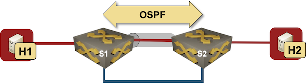

# VXLAN Bridging with OSPF

This directory demonstrates what might happen when you run OSPF on VXLAN-enabled VLAN interfaces.



The directory contains two topologies:

* `topology-broken.yml` runs the same OSPF instance on physical interfaces and VLAN interfaces, resulting in recursive routing
* `topology-fixed.yml` isolates tenant routing in a VRF resulting in a working network even when S1 and S2 run OSPF across a VXLAN-enabled VLAN

## Changing Device Types

This topology can be used with all network devices supporting VLAN, VXLAN, and OSPF configuration modules, and all virtualization providers supported by *netlab*:

* To change the switch device type, use `-s groups.switch.device=xxx` CLI argument
* To change the virtualization provider, use `-p` CLI argument.

For example, to start the lab with Nexus 9300v switches using _libvirt_, use:

```
netlab up -p libvirt -s groups.switches.device=nxos
```
