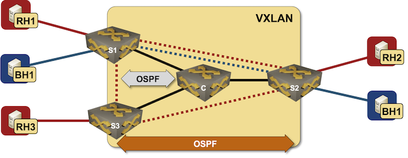

# VRF Lite with VXLAN Transport

This directory contains *netlab* topology file for a VRF Lite topology using VXLAN as the core transport protocol.



After starting the lab, rh1 should be able to ping rh2 and rh3, and bh1 should be able to ping bh2.

## Changing Device Types

This topology can be used with all network devices supporting VLAN, VRF, VXLAN, and OSPF configuration modules, and all virtualization providers supported by *netlab*:

* To change the switch device type, use `-d xxx` CLI argument
* To change the virtualization provider, use `-p` CLI argument.

For example, to start the lab with Cumulus Linux devices running in _containerlab_, use:

```
netlab up -p clab -d cumulus
```
