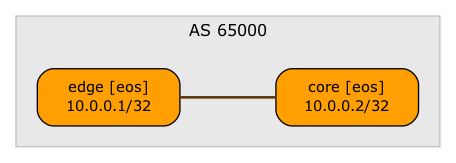

# Applying Simple Configuration Changes

This directory contains a small lab topology that [applies an extra configuration command](https://blog.ipspace.net/2025/10/netlab-simple-configuration-changes/) to one of the devices using the **config.inline** node attribute.

