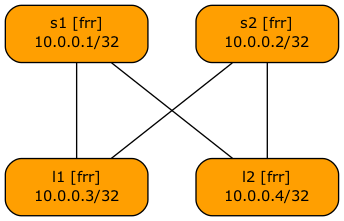
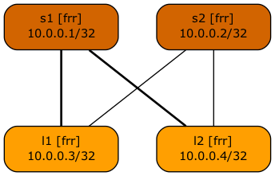

# Changing Graph Colors and Line Styles

This directory contains lab topologies used to illustrate the _netlab_ graph customization capabilities:

| Topology | Description | Diagram |
|----------|-------------|:-------:|
| [topology.yml](topology.yml) | Baseline leaf-and-spine fabric | { width=300px } |
| [spine-color.yml](spine-color.yml) | Changing node background | { width=300px } |
| [link-width.yml](link-width.yml) | Changing line width | { width=300px } |
| [text-color.yml](text-color.yml) | Changing text color | { width=300px } |
