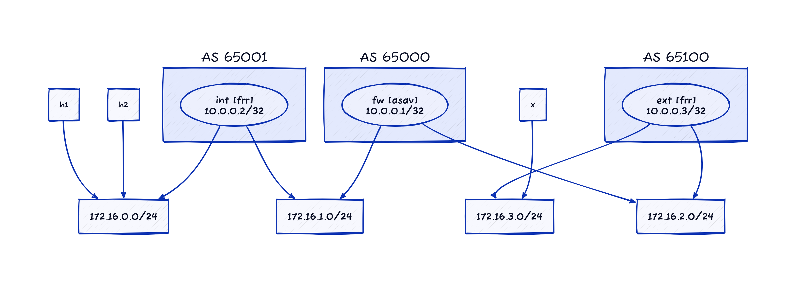

# Sample Cisco ASAv Topology

This directory contains the lab topology described in the [Sample Cisco ASAv Topology](https://blog.ipspace.net/2024/12/netlab-asav-topology/) blog post. The [config](config) directory contains the initial device configurations generated by **netlab initial**

