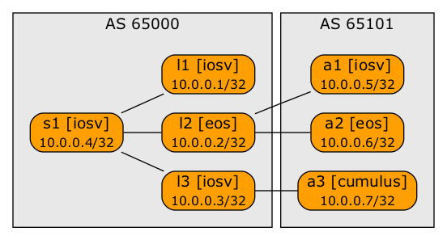

# Multi-Platform BGP Anycast Lab

This lab illustrates the *netlab* multi-platform custom configuration templates. It requires _netlab_ release 1.5.0 or later.

**Notes:**
* Anycast nodes are a mix of Cisco IOSv, Arista vEOS, and Cumulus VX
* Leaf nodes are a mix of Cisco IOSv and Arista vEOS
* Anycast configuration templates are in the `bgp-anycast` directory
* *BGP Additional Paths* configuration templates are in the `bgp-addpath` directory
