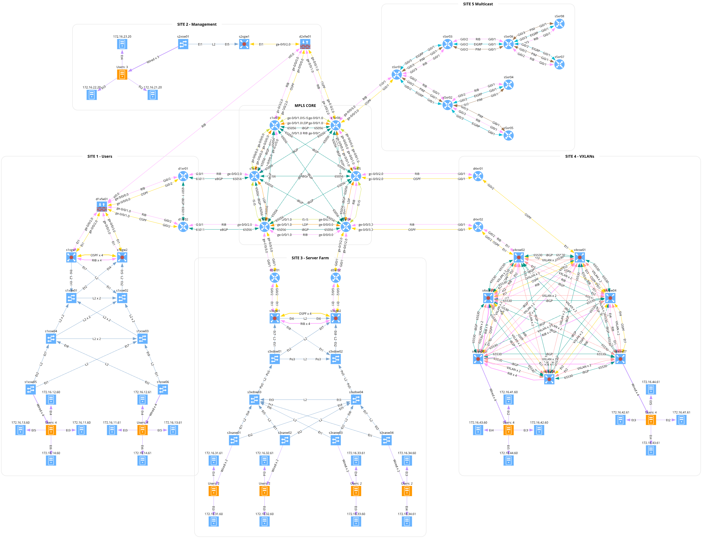

# General lab description
We really needed to create a lab to test some features and to have a playground for new ideas. Netlab provided an excellent platform to create a lab with a variety of devices and topologies programmatically. 
The topology looks like an enormous robotic crane with a lot of moving parts - hence the name **Cyber Crane Mesh**.

This lab creates a network with:

- 6 core nodes (srx)
- 8 distribution FW and RTR nodes connecting core to sites (srx and ios)
- 6 User site `s1` nodes (eos)
- 2 User site `s2` nodes (eos)
- 10 Server site `s3` nodes (eos)
- 7 VXLAN site `s4` nodes (eos)
- 8 Multicast site `s5` nodes (ios)
- 51 linux nodes to emulate users and servers

## Few notes
We run the lab on the local machine with 128GB RAM and 32 cores:
- it takes about 30 minutes to start the lab (we use `libvirt.batch_size: 8` to spread the load)
- with our images it consumes about 110+ GB of RAM (we had to add 3 GB to Arista devices running VXLANs)
- there's plenty of static addressing involved - we tried to keep it simple and consistent
  - endpoints are `.60` or `.61` except management servers, those are `.20`
  - subnets and VLAN IDs are corresponding with the Site ID `172.16.[site_id][1-4].X/24` - VLAN `[site_id]0[site_id][1-4]`

## Playbooks
We have a few playbooks to help with the lab. We decided that the best was to run the lab smoothly was not to interfere with the lab build process in any way with additional configs or modifications.
The lab is started only with the `topology.yml` file and with **Netlab** features. Additional playbooks are applied to the lab after it's started:
- `playbooks/master-playbook.yml` - contains all playbooks to add additional configurations to the lab (Lag, Mgmt protocols, etc.)
- `playbooks/security-playbook.yml` - contains playbooks to add security features to the lab (Policies, NAT, IPSec, etc.)

## Cyber Crane Topology

