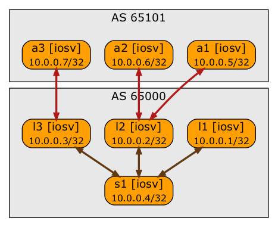

# Anycast Lab Using a netlab Plugin

This lab extends the lab that [tested BGP-based anycast with BGP Additional Paths functionality](https://blog.ipspace.net/2021/12/bgp-anycast-lab.html) with a plugin that removes IBGP sessions between anycast nodes, resulting in the following lab topology:

To start the lab:

* [Install the prerequisite software](https://netsim-tools.readthedocs.io/en/latest/install.html#creating-the-lab-environment).
* Build [Cisco IOSv](https://netsim-tools.readthedocs.io/en/latest/labs/iosv.html) or [Cisco CSR](https://netsim-tools.readthedocs.io/en/latest/labs/csr.html) Vagrant box.
* Execute **netlab up**

If you want to use the lab with another network device, add loopback configuration and BGP Add Path configuration commands to device-specific templates in in **bgp-addpath** and **bgp-anycast** directories.
