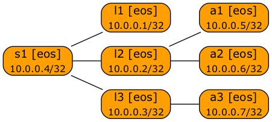

# Anycast Lab: OSPF+MPLS

This lab was used to [debunk the _anycast doesn't work with MPLS/LDP_ claim](https://blog.ipspace.net/2021/11/anycast-mpls.html).

To start the lab:

* [Install the prerequisite software](https://netsim-tools.readthedocs.io/en/latest/install.html#creating-the-lab-environment) (netlab, Ansible, Docker, containerlab) on a Ubuntu server.
* Download and install Arista cEOS image
* Execute **netlab up**

Alternatively, you can take the [configuration tarball](anycast-mpls-ospf.tar.gz), extract it into an empty directory, and start  the lab with *containerlab*.
