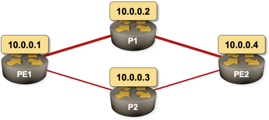

# Link Failure Failover Testing

The following network topology was built with vagrant-libvirt provider on a Ubuntu machine using P2P UDP tunnels emulating Ethernet links:

Challenge: what exactly happens when one of the primary links fails?

## Try it out

* Clone the repository.
* [Install *netlab*](https://netsim-tools.readthedocs.io/en/latest/contribute.html)
* Get Cisco IOS boxes for your Vagrant environment. For more extensive modifications [read this first](https://netsim-tools.readthedocs.io/en/latest/).
* It should be trivial to replace IOS devices with other network devices -- *netlab* supports OSPF on all supported platforms.
* Start the lab with **netlab up**
* Enjoy!