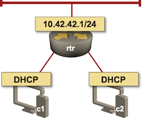

# Unnumbered Ethernet Interfaces Test Lab

This lab setup was used to produce printouts in the _[Unnumbered Ethernet Interfaces](https://blog.ipspace.net/2021/06/unnumbered-ethernet-interfaces.html)_ and _[Unnumbered Ethernet Interfaces, DHCP Edition](https://blog.ipspace.net/2021/06/unnumbered-ethernet-dhcp.html)_ blog posts.



Note: The IP addressing varies across different scenarios

The final router configurations used to produce the printouts in the blog posts are in the _static-routes_ and _DHCP_ directories.

To recreate the lab:

* [Install *netlab*](https://netsim-tools.readthedocs.io/en/latest/install.html) and [create your lab environment](https://netsim-tools.readthedocs.io/en/latest/install.html#building-the-lab-environment)
* Clone this repository (or download the contents of this directory)
* Start the lab with **netlab up _filename_**. Use *topology.yml* for static routes lab, and _dhcp.yml_ for the DHCP lab.

## Configuring DHCP Lab

* Configure DHCP client on _c1_ and _c2_ with

```
netlab config dhcp-client.j2 -l c1,c2
```

* Configure DHCP server on _rtr_ with

```
netlab config dhcp-server.j2 -l rtr
```

There are no corresponding configuration templates for the *unnumbered interfaces with static routes* lab; use the final router configurations as a guidance.
