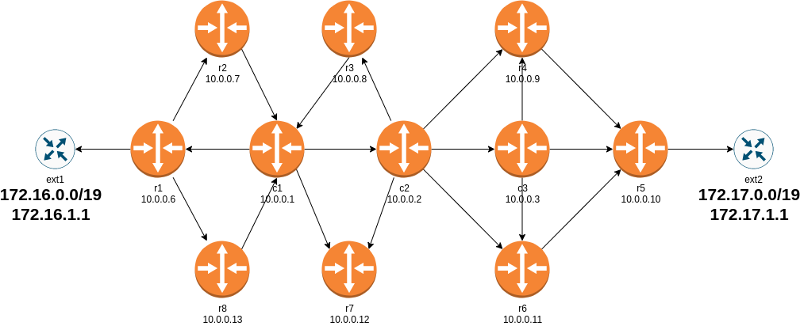

# RSVP-TE on Juniper vSRX Test Lab

This lab creates a network topology with:

* 8 x PE routers
* 3 x P routers
* 2 x CE routers

## Topologies

* Juniper SRX with RSVP-TE

## To recreate the lab

* [Install *netlab*](https://netsim-tools.readthedocs.io/en/latest/install.html) and [create your lab environment](https://netsim-tools.readthedocs.io/en/latest/install.html#building-the-lab-environment)
* Clone this repository (or download the contents of this directory)
* Create the configuration files and start the simulation with `netlab up vsrx_rsvp.yml`
