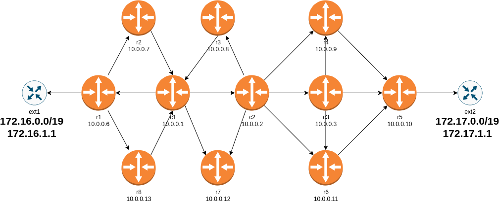

# SPRING/SR on Juniper vSRX Test Lab

This lab creates a network topology with:

* 8 x PE routers
* 3 x P routers
* 2 x CE routers

## Topologies

* Juniper SRX with Segment Routing



## To recreate the lab

* [Install *netlab*](https://netsim-tools.readthedocs.io/en/latest/install.html) and [create your lab environment](https://netsim-tools.readthedocs.io/en/latest/install.html#building-the-lab-environment)
* Clone this repository (or download the contents of this directory)
* Create the configuration files and start the simulation with `netlab up vsrx_sr.yml`

## Example SR path

No SR paths are defined by default, however an example of how to configure a static SR path can be seen in the backed up configuration files for the devices `r1` and `r5`. With these LSPs installed, you can run the following traceroute from the device `ext1` and see the sub-optimal LSP path being taken:

```
vagrant@ext1> traceroute source 172.16.1.1 172.17.1.1 
traceroute to 172.17.1.1 (172.17.1.1) from 172.16.1.1, 30 hops max, 52 byte packets
 1  10.10.10.2 (10.10.10.2)  3.181 ms  0.880 ms  0.878 ms
 2  10.0.0.11 (10.0.0.11)  6.868 ms  0.733 ms  0.635 ms
     MPLS Label=800407 CoS=0 TTL=1 S=1
 3  10.0.0.7 (10.0.0.7)  70.670 ms  2.798 ms  4.628 ms
 4  10.0.0.12 (10.0.0.12)  72.054 ms  1.933 ms  2.058 ms
     MPLS Label=800405 CoS=0 TTL=1 S=1
 5  10.0.0.13 (10.0.0.13)  69.306 ms  2.518 ms  2.665 ms
     MPLS Label=800405 CoS=0 TTL=1 S=1
 6  10.0.0.5 (10.0.0.5)  79.759 ms  71.732 ms  2.577 ms
 7  172.17.1.1 (172.17.1.1)  5.511 ms  71.617 ms  3.928 ms
```

## Static LSP Config Example

This is applied manually on `r1`:

```
set protocols source-packet-routing tunnel-tracking
set protocols source-packet-routing segment-list P1 hop label 800403
set protocols source-packet-routing segment-list P2 hop label 800407
set protocols source-packet-routing source-routing-path sr_lsp1 to 10.0.0.5
set protocols source-packet-routing source-routing-path sr_lsp1 primary P1
set protocols source-packet-routing source-routing-path sr_lsp1 secondary P2
```

This is applied manually on `r5`:

```
set protocols source-packet-routing tunnel-tracking
set protocols source-packet-routing segment-list P1 hop label 800403
set protocols source-packet-routing segment-list P2 hop label 800407
set protocols source-packet-routing source-routing-path sr_lsp1 to 10.0.0.1
set protocols source-packet-routing source-routing-path sr_lsp1 primary P1
set protocols source-packet-routing source-routing-path sr_lsp1 secondary P2
```
