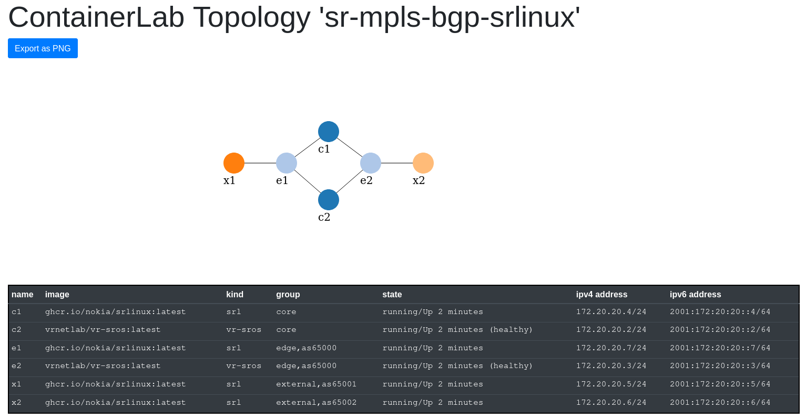

# SROS/SRLinux SR-MPLS example using SR-ISIS

Commemorating the release of SR Linux 21.11.1, now with SR-MPLS support (on 7250 IXR platforms), this repo presents an end-2-end topology featuring a BGP-free core.

X1 can ping X2:
```
A:x1# ping 10.0.0.6

Using network instance default
PING 10.0.0.6 (10.0.0.6) 56(84) bytes of data.
64 bytes from 10.0.0.6: icmp_seq=1 ttl=61 time=16.1 ms
64 bytes from 10.0.0.6: icmp_seq=2 ttl=61 time=16.7 ms

--- 10.0.0.6 ping statistics ---
2 packets transmitted, 2 received, 0% packet loss, time 1001ms
rtt min/avg/max/mdev = 16.118/16.423/16.729/0.331 ms
```

using an MPLS datapath via E1-{C1 or C2}-E2.

E2 and C2 are SROS nodes, the others are SRLinux IXR6 nodes running 21.11.1

## Netsimtools
Requires [this](https://github.com/ipspace/netsim-tools/pull/85) PR to add support for ISIS and SR modules
